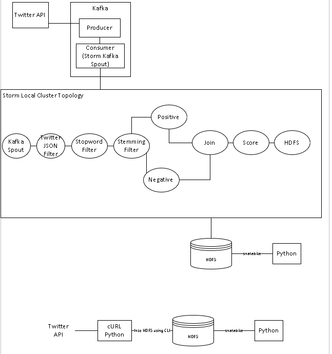
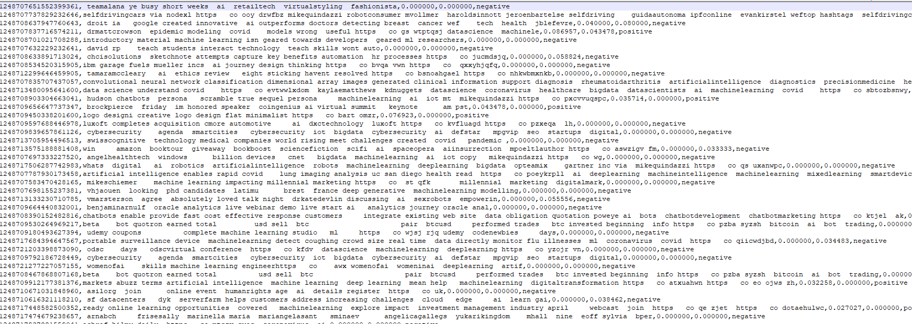
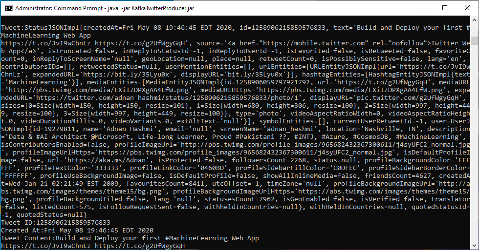
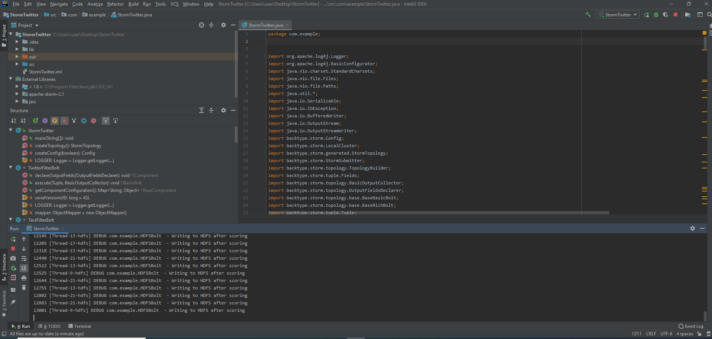

# Twitter_Sentiment_AI

Big Data analysis of Twitter data via API to analyze users' sentiment about use of AI/ML Techniques by Private Companies

## Features

1. Using initial batch analysis from Twitter API into HDFS for Python Sentiment Analysis training.
2. Deploying Real-Time Streaming analytics engine powered by Apache Kakfa, Apache Storm, Apache Hadoop & Python.
3. Python used for visualizations, Hadoop Windows VM Instance used for reproducibility.

## Technologies

1. Apache Flume
2. Apache Maven
3. Apache Kafka
4. Apache Storm
5. Apache Hadoop (HDFS)
6. Apache Zookeeper
7. Jupyter Notebooks

## Installation

### VM Installation

1. download and install virtualbox
2. go to file -> import appliance
3. Request Windows10UMBC_Spring_2020_Twitterv3final.ova image from EHGP
4. Run the VM
5. Login: User:password

### Application Execution

1. start hadoop with on Administrator CMD: start-all.cmd
2. start kafka and storm in same cli: storm-start-all.cmd
3. start namenode health chrome shortcut or put this in browser: <http://localhost:50070/dfshealth.html#tab-overview>
go to utilities tab and click on 'Browse File System'
4. check on stormtwitter cli log for "DEBUG com.example.HDFSBolt  - Writing to HDFS after scoring"
5. refresh namenode health browse file system window to see csv files increase size as they accumulate tweets realtime
6. to run another instance of stormtwitter run on same cli: stormtwitter-start.cmd

## Screenshots

### Architecture

### HDFS Folder

### Data Formatting

### Kafka Twitter Producer

### Storm Twitter

## Authors

Joel Nantais, Chuck Rainville & [EHGP](https://ehgp.github.io)
